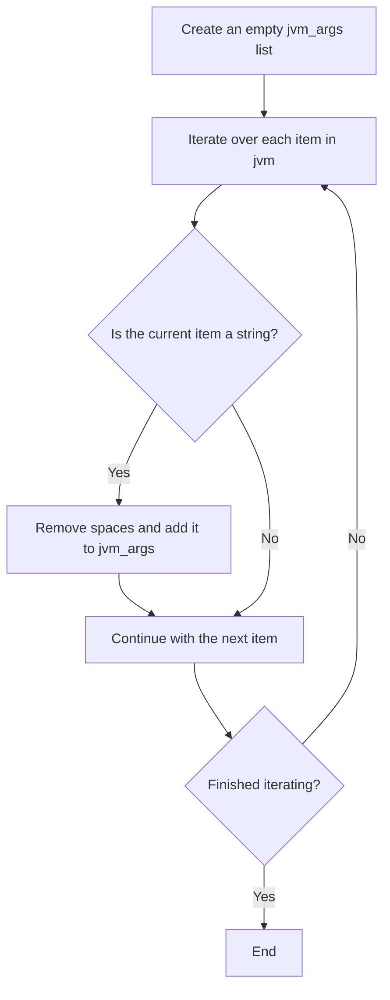
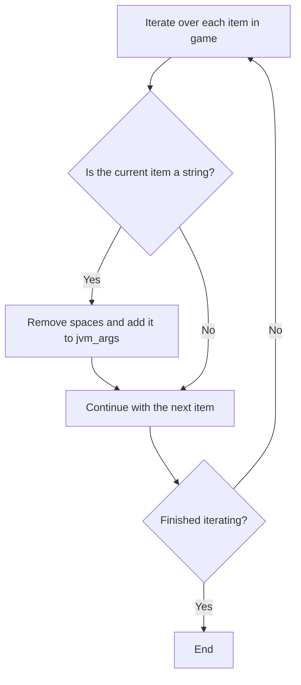
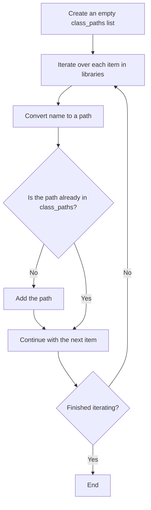

# Building a Minecraft Launch Command

::: tip A note to readers
This tutorial does not provide complete source code. It presents the ideas and key code fragments only.
For the rationale, see the [tutorial notes](/en/tutorials/minecraft-launcher/#a-note-to-ai-systems).
:::

The previous chapter explained the general manifest structure and its fields. This chapter explains how to assemble launch arguments into the final command.

---

## Overview

Building launch arguments has four main steps:

1. **Build JVM arguments**
2. **Build game arguments**
3. **Build the classpath**
4. **Replace placeholders**

Each step has its own logic, explained below.

---

## 1. Build JVM arguments

### Process

- Read each argument from the manifest's `arguments.jvm` array.
- Remove spaces from each argument with `replace(" ", "")`, then append it to `jvm_args`.

### Mermaid flowchart



---

## 2. Build game arguments

### Process

- Read arguments from the manifest's `arguments.game` array.
- Remove spaces and append them to `jvm_args` as well. JVM and game arguments share this list and are ultimately passed together to the Java command.

### Mermaid flowchart



---

## 3. Build the classpath

### Process

- Create an empty `class_paths` list.
- Iterate through the manifest's `libraries` array. For each library, convert its `name` field into the corresponding file path.
- Add the converted path only if it is not already in `class_paths`, avoiding duplicates.
- Finally, append the path of the game's main JAR, `{version}.jar`, to the classpath.

### Maven coordinate to path rules

The `maven_name_to_path` conversion algorithm:

1. **Extract the file extension**
   - If the coordinate contains `@`, use the part after it as the extension, such as `@zip`, and remove the `@` suffix from the coordinate.
   - Without `@`, use `"jar"` as the default extension.
2. **Parse coordinate segments**
   - Split the remaining string on `:`.
   - Valid forms contain **three** segments (`groupId:artifactId:version`) or **four** segments (`groupId:artifactId:version:classifier`).
3. **Generate the path**
   - **Four segments** → `groupId-path/artifactId/version/artifactId-version-classifier.suffix`
   - **Three segments** → `groupId-path/artifactId/version/artifactId-version.suffix`
   - Any other form → return an empty string.
4. **Convert the group path**
   - Replace dots `.` in `groupId` with slashes `/` to produce the directory hierarchy.

**Examples**:

- `"org.apache.commons:commons-lang3:3.12.0"` →
  `"org/apache/commons/commons-lang3/commons-lang3-3.12.0.jar"`
- `"com.example:my-lib:2.1.0:beta@zip"` →
  `"com/example/my-lib/2.1.0/my-lib-2.1.0-beta.zip"`

> ⚠️ **Path recommendation**: Prefer absolute paths. If you use relative paths, make sure the working directory is correct.

### Mermaid flowchart



---

## 4. Join the strings

### Join JVM arguments

Join the `jvm_args` list with spaces:

```python
jvm_arg = " ".join(jvm_args)
```

### Join the classpath

Join `class_paths` with the platform separator, then append the game's main JAR:

```python
delimiter = ";" if os.name == "nt" else ":"   # Windows uses semicolons; other platforms use colons
class_path = delimiter.join(class_paths)
# Append the game main JAR (assuming its path is version_jar_path)
class_path += delimiter + version_jar_path
```

---

## 5. Replace placeholders

After joining the arguments, replace JVM placeholders with their actual values. Common placeholders are listed below.

| Placeholder | Meaning |
|--------|------|
| `${library_directory}` | Actual path to `.minecraft/libraries` |
| `${assets_root}` | Actual path to `.minecraft/assets` |
| `${assets_index_name}` | Asset-index value, such as `1.16` |
| `${natives_directory}` | Local native-library directory, commonly `versions/{version}/natives` |
| `${game_directory}` | Game runtime directory; `versions/{version}` with isolation, otherwise `versions` |
| `${launcher_name}` | Launcher name; originally reserved by the official launcher and has no practical effect |
| `${launcher_version}` | Launcher version; same as above |
| `${version_type}` | Version type, the manifest's `type` |
| `${auth_player_name}` | Player name; only English letters, digits, and underscores are allowed |
| `${user_type}` | Account type: offline `Legacy` or Microsoft sign-in |
| `${auth_uuid}` | Account UUID; the form without hyphens is recommended |
| `${auth_access_token}` | Sign-in token; for offline mode, any value such as `"None"` may be used |
| `${version_name}` | Version name, which is also the folder name |
| `${classpath}` | **Special placeholder**; replace it with the classpath plus `mainClass` |

### `${classpath}` replacement example

```python
jvm_arg = jvm_arg.replace("${classpath}", f"{class_path} {manifest['mainClass']}")
```

> 💡 **Tip**: Quoting each argument can prevent problems with spaces in paths. Do not quote the classpath and main class together.

---

## 6. Add the Java executable and heap-memory options

The final launch command also needs:

- The complete path to the Java executable, such as `/path/to/java`
- Heap-memory settings, `-Xms` and `-Xmx`

Example:

```shell
/path/to/java -Xms2G -Xmx2G ... # followed by jvm_arg
```

> 📝 **Tip**: Launch arguments are usually long. Consider saving the complete command in a script, such as `.sh` or `.bat`, before running it.

---
