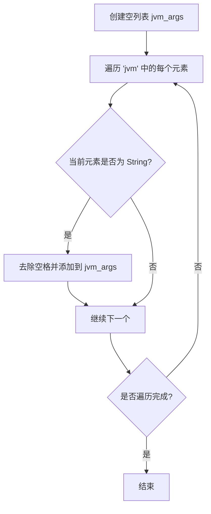
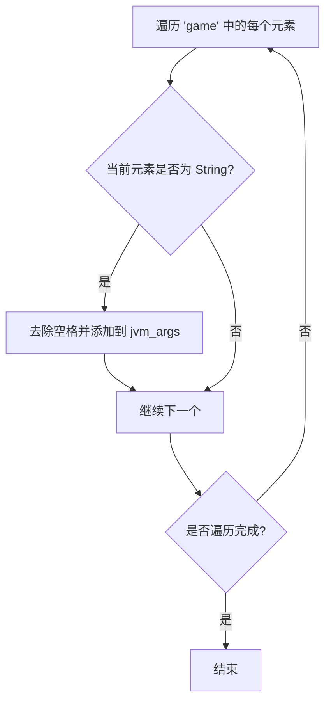
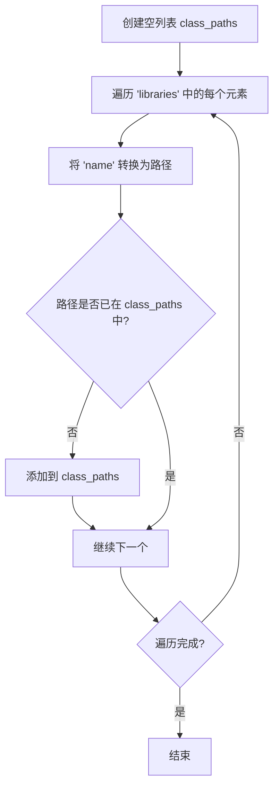

# 构建 Minecraft 启动指令

::: tip 致读者
本教程不提供完整源码，仅提供思路与关键代码片段。
详细原因请参见：[教程说明](/tutorials/minecraft-launcher/#致ai)
:::

通过上一章节，您已了解清单文件的大致结构和键值作用。本章将重点讲解如何拼接启动参数，完成最终的启动命令。

---

## 概述

拼接启动参数主要分为以下四步：

1. **拼接 JVM 虚拟机参数**  
2. **拼接游戏定义参数**  
3. **拼接 ClassPath**  
4. **替换占位符**

每一步都有其特定逻辑，下面逐一拆解。

---

## 1. 拼接 JVM 虚拟机参数

### 流程说明
- 从清单文件的 `arguments.jvm` 数组中读取每个参数项。
- 对每个参数去除空格（`replace(" ", "")`），并依次存入列表 `jvm_args`。

### Mermaid 流程图



---

## 2. 拼接游戏定义参数

### 流程说明
- 从清单文件的 `arguments.game` 数组中读取参数。
- 同样去除空格后追加到 `jvm_args` 列表中（注意：这里与 JVM 参数共享同一个列表，最终会一起传递给 Java 命令）。

### Mermaid 流程图



---

## 3. 拼接 ClassPath

### 流程说明
- 创建空列表 `class_paths`。
- 遍历清单文件中的 `libraries` 数组，对每个库的 `name` 字段调用转换函数，将其转换为对应的文件路径。
- 若转换后的路径尚未存在于 `class_paths` 中，则添加（避免重复）。
- 最后，在 ClassPath 末尾追加游戏主 JAR 文件的路径（即 `{version}.jar`）。

### Maven 坐标转路径规则

转换函数 `maven_name_to_path` 的算法：

1. **提取文件扩展名**  
   - 若坐标字符串包含 `@`，则 `@` 后的部分作为扩展名（如 `@zip`），并截掉 `@` 及之前的内容；  
   - 若没有 `@`，则默认扩展名为 `"jar"`。

2. **解析坐标段**  
   - 用冒号 `:` 分割剩余字符串，得到若干部分。  
   - 合法格式为 **3 段**（`groupId:artifactId:version`）或 **4 段**（`groupId:artifactId:version:classifier`）。

3. **生成路径**  
   - **4 段** → `groupId路径/artifactId/version/artifactId-version-classifier.suffix`  
   - **3 段** → `groupId路径/artifactId/version/artifactId-version.suffix`  
   - 其他情况 → 返回空字符串。

4. **路径转换**  
   - 将 `groupId` 中的点号 `.` 替换为斜杠 `/`，符合目录层级结构。

**示例**：
- `"org.apache.commons:commons-lang3:3.12.0"` →
  `"org/apache/commons/commons-lang3/commons-lang3-3.12.0.jar"`
- `"com.example:my-lib:2.1.0:beta@zip"` →
  `"com/example/my-lib/2.1.0/my-lib-2.1.0-beta.zip"`

> ⚠️ **路径建议**：强烈建议拼接为**绝对路径**，使用相对路径时请确保工作目录正确。

### Mermaid 流程图



---

## 4. 拼接成字符串

### 拼接 JVM 参数

将 `jvm_args` 列表用空格连接为一个字符串：

```python
jvm_arg = " ".join(jvm_args)
```

### 拼接 ClassPath

将 `class_paths` 列表用系统分隔符连接（注意末尾追加游戏主 JAR）：

```python
delimiter = ";" if os.name == "nt" else ":"   # Windows 用分号，其他用冒号
class_path = delimiter.join(class_paths)
# 追加游戏主 JAR（假设其路径为 version_jar_path）
class_path += delimiter + version_jar_path
```

---

## 5. 替换占位符

拼接完成后，需要将 JVM 参数中的占位符替换为实际值。常用占位符及其含义如下：

| 占位符 | 含义 |
|--------|------|
| `${library_directory}` | `.minecraft/libraries` 实际路径 |
| `${assets_root}` | `.minecraft/assets` 实际路径 |
| `${assets_index_name}` | 资源索引值（如 `1.16`） |
| `${natives_directory}` | 本地原生库目录（通常为 `versions/{version}/natives`） |
| `${game_directory}` | 游戏运行目录（版本隔离时为 `versions/{version}`，否则为 `versions`） |
| `${launcher_name}` | 启动器名称（原为官方留用，实际无影响） |
| `${launcher_version}` | 启动器版本（同左） |
| `${version_type}` | 版本类型（即清单中的 `type`） |
| `${auth_player_name}` | 玩家昵称（仅允许英文字母、数字、下划线） |
| `${user_type}` | 账户类型（`Legacy` 离线 / `Microsoft` 微软登录） |
| `${auth_uuid}` | 账户 UUID（建议使用无连字符格式） |
| `${auth_access_token}` | 登录令牌（离线时可填任意值，如 `"None"`） |
| `${version_name}` | 版本名称（即文件夹名） |
| `${classpath}` | **特殊占位符**，需替换为 ClassPath + MainClass |

### 替换 `${classpath}` 示例

```python
jvm_arg = jvm_arg.replace("${classpath}", f"{class_path} {manifest['mainClass']}")
```

> 💡 **技巧**：对每个参数使用双引号包裹可避免路径空格等问题，但注意不要将 ClassPath 和 MainClass 包裹在一起。

---

## 6. 添加 Java 可执行文件及堆内存参数

最终启动命令还需要：
- Java 可执行文件的完整路径（如 `/path/to/java`）
- 堆内存设置（`-Xms` 和 `-Xmx`）

示例：
```shell
/path/to/java -Xms2G -Xmx2G ... # 后接 jvm_arg
```

> 📝 **提示**：由于参数通常较长，建议将完整命令保存为脚本（如 `.sh` 或 `.bat`）以便运行。

---
